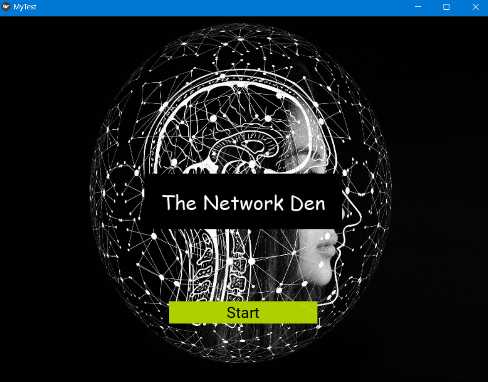
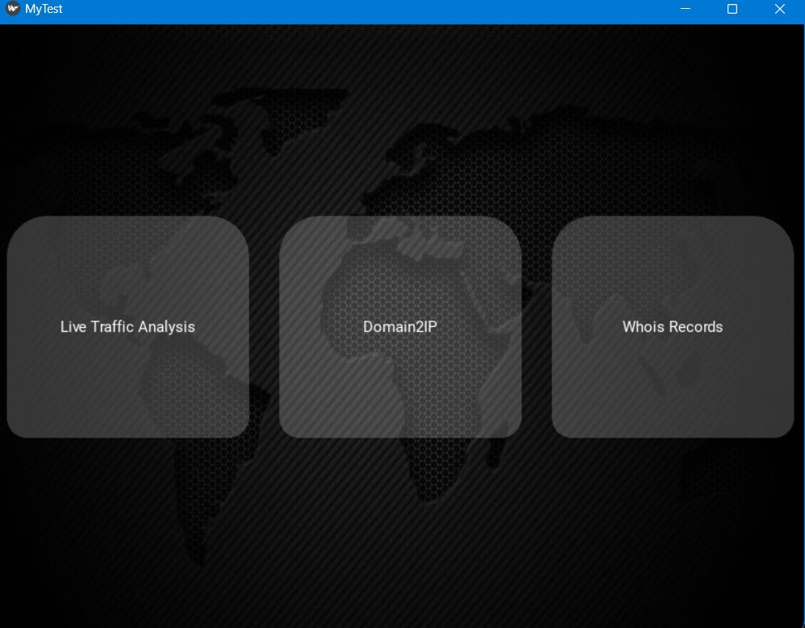
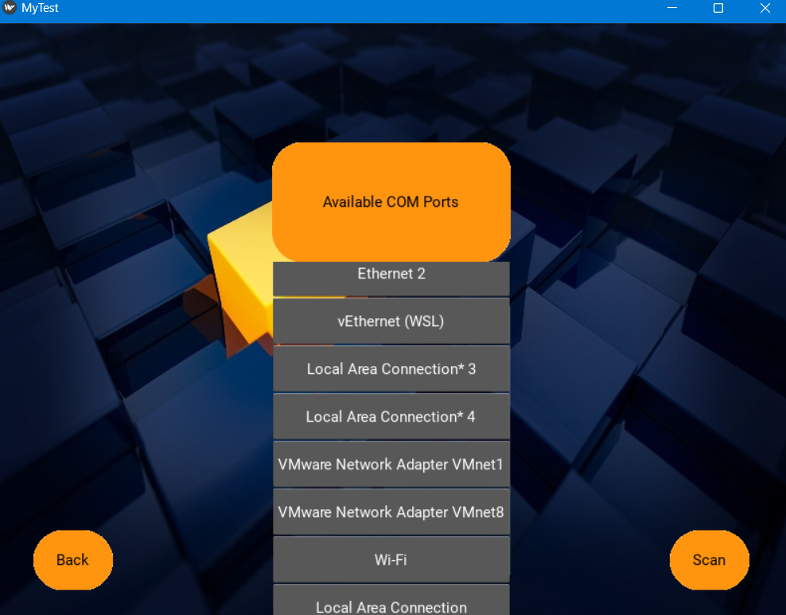
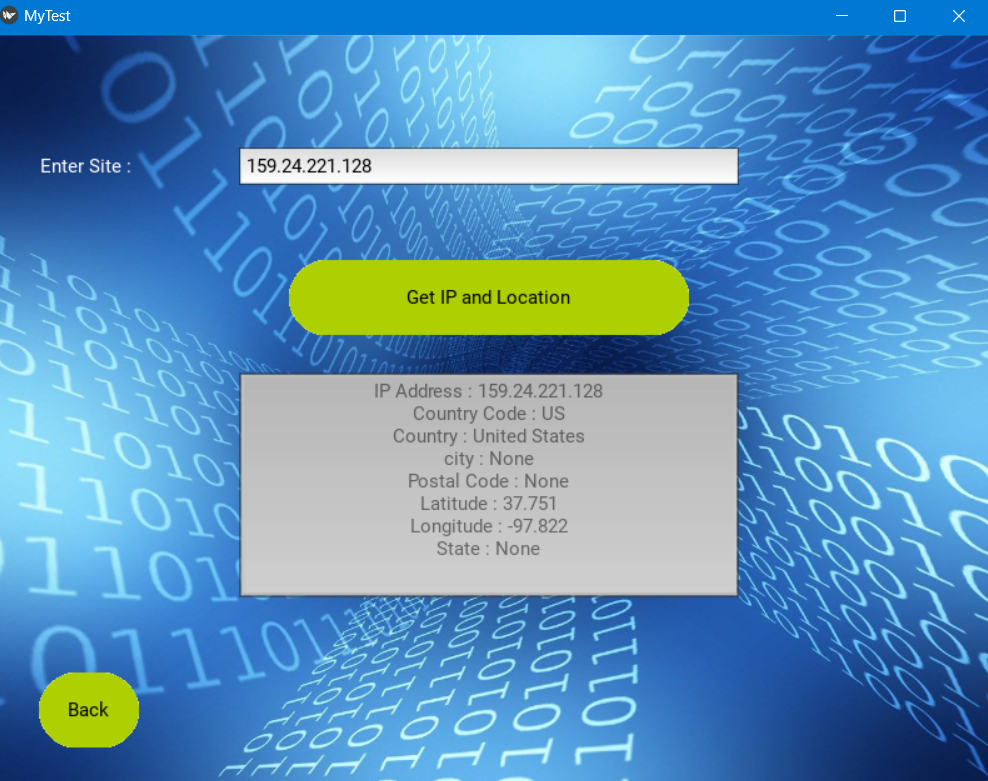
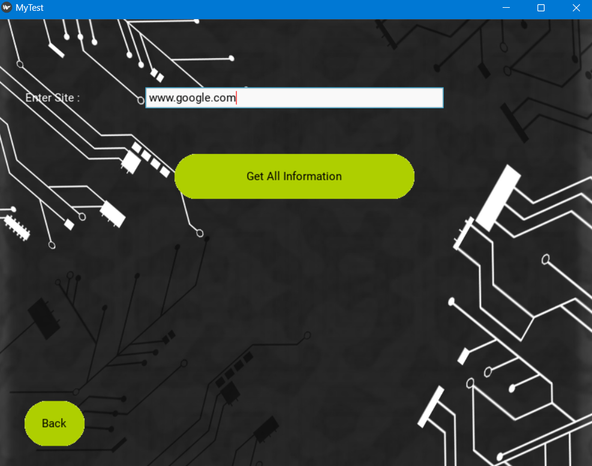

# The Network Den

## Tech Specifications
- Python
- Flask
- Kvlang

## Description
The Network Den (TND) is a GUI-based network analysis tool built with the Kivy framework in Python. It offers three key functionalities for network analysis.

### Feature 1: Live Traffic Analysis
TND provides real-time traffic analysis for various network interfaces such as Ethernet, vEthernet, Wi-Fi, and virtual machines.

### Feature 2: Domain to IP
TND allows users to enter a domain name and retrieve information about the corresponding IP address.

### Feature 3: Whois Records
With this feature, users can enter a domain site and fetch the Whois records, providing specific information about the domain.

## Screenshots

### Home

The home screen of The Network Den application.

### Feature List

A list of available features in the application.

### Live Traffic Analysis

Real-time analysis of network traffic for different network interfaces.

### Domain to IP

Retrieving information about the IP address of a domain.

### Whois Records

Fetching and displaying the Whois records for a domain.

## How to Run
1. Clone the repository: `git clone <repository-url>`
2. Navigate to the project directory: `cd The-Network-Den`
3. Run the main Python file: `python temp_scroll.py`
4. Access the application in your GUI environment.

